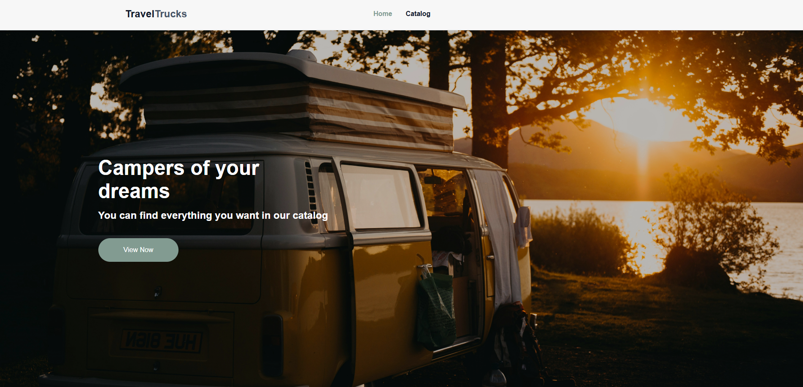
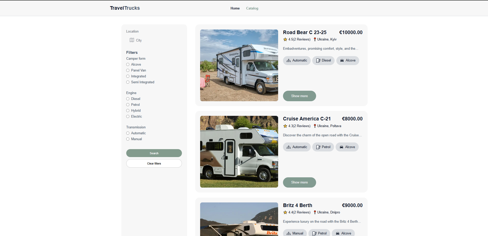
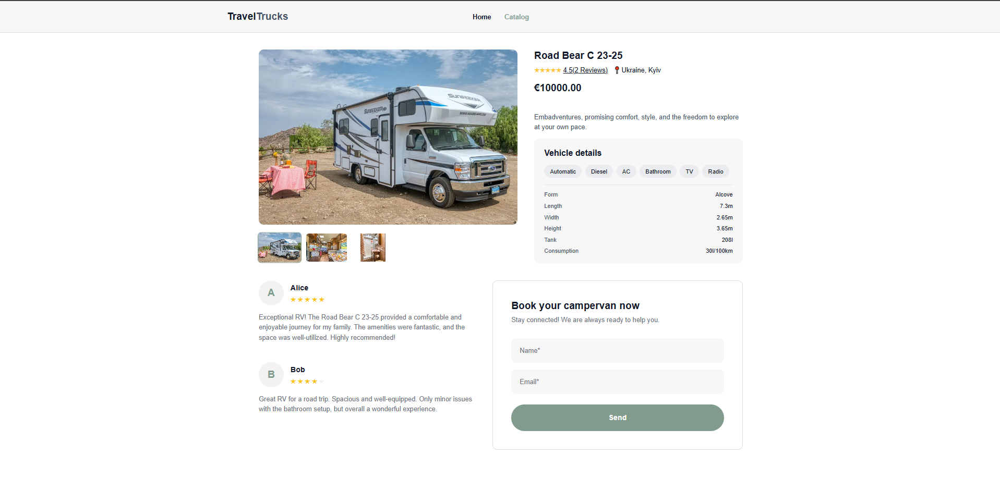

# TravelTrucks - Caravan Rental App

A frontend web application that allows users to browse camper models, apply feature-based filters, and book rental reservations.

---

## 🚀 Features

- **Catalog Page:** A dynamic area where all camper models are listed.
- **Detailed Filtering:** Advanced search functionality by equipment (AC, Kitchen, TV, etc.) and vehicle type.
- **Favorites System:** Ability to add and track your favorite campers.
- **"Load More" Functionality:** Optimized data loading using pagination logic to enhance performance.
- **Reservation Form:** A dedicated form for users to submit rental requests for their selected campers.
- **Responsive Design:** Fully compatible interface for mobile, tablet, and desktop devices.

## 🛠️ Tech Stack

- **Frontend:** React (Vite)
- **State Management:** Redux Toolkit
- **API Client:** Axios
- **Routing:** React Router Dom
- **Styling:** CSS Modules
- **Icons:** React Icons

## Live Demo

> **App:** (https://travel-trucks-tau-seven.vercel.app/)

## Screenshots

| Home Page                                 | Catalog Page                                    | Details Page                                    |
| ----------------------------------------- | ----------------------------------------------- | ----------------------------------------------- |
|  |  |  |

## Tech Stack

### Frontend

| Technology        | Version   | Purpose                            |
| ----------------- | --------- | ---------------------------------- |
| React             | 19.2.4    | UI framework                       |
| Vite              | 8.0.1     | Build tool & dev server            |
| React Router DOM  | 7.13.2    | Client-side routing                |
| Redux Toolkit     | 2.11.2    | State management                   |
| React Redux       | 9.2.0     | Redux-React bindings               |
| Redux Persist     | 6.0.0     | Persist auth state to localStorage |
| Axios             | 1.13.6    | HTTP client                        |
| React Toastify    | 11.0.5    | Toast notifications                |
| React DatePicker  | 9.1.0     | Date selection in diary            |
| ESLint + Prettier | 9.x / 3.x | Code quality & formatting          |

## 📁 Project Structure

src/
├── assets/ # Static files (Images, SVGs, Fonts)
├── components/ # Reusable UI components
│ ├── layout/ # Layout components (Header, Footer, Navigation)
│ ├── catalog/ # Catalog-specific components (CamperCard, LoadMoreButton)
│ ├── filters/ # Filtering components (Sidebar, CheckboxGroup)
│ └── shared/ # Common UI elements (Button, Loader, Modal)
├── features/ # Redux logic and State management
│ └── campers/ # Slice, Selectors, and Thunks for camper data
├── hooks/ # Custom React Hooks
├── pages/ # Main page views
│ ├── HomePage/ # Landing page
│ ├── CatalogPage/ # Main catalog listing
│ └── FavoritesPage/ # Saved/Favorite campers view
├── services/ # API services and configurations
│ └── axiosInstance.js# Axios base URL and interceptor settings
├── store/ # Redux Store setup and rootReducer
├── styles/ # Global CSS and theme variables
├── utils/ # Helper functions and formatters
├── App.jsx # Main application component & high-level routes
├── AppRouter.jsx # Routing configuration and logic
└── main.jsx # Application entry point and DOM rendering

## Getting Started

### Prerequisites

- Node.js v18+
- npm v9+

### 1. Clone the Repository

```bash
git clone git@github.com:duhanocal03/TravelTrucks.git
cd TravelTrucks
```

### 2. Install Dependencies

```bash
# Install server dependencies
cd server
npm install
```

## License

This project was developed as part of the [GoIT](https://goit.global) FullStack Developer course.
